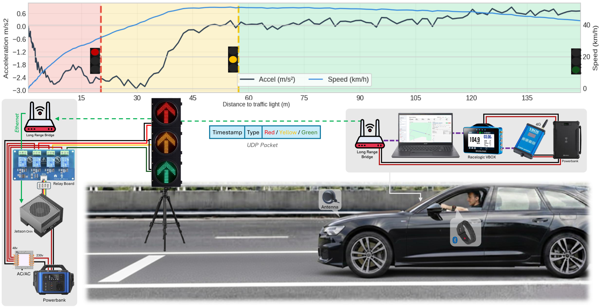
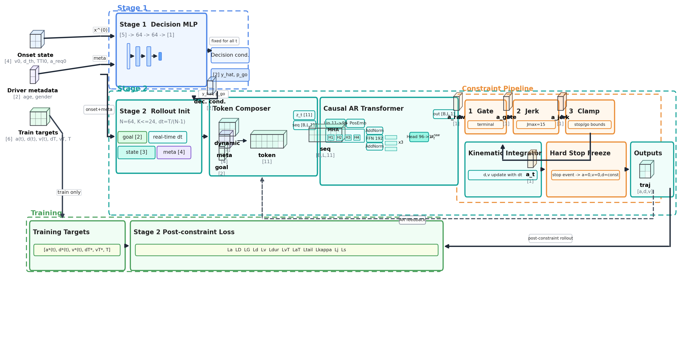

# StopGo Transformer


This repository contains the public code and processed data for predicting human driver stop/go behavior at yellow onset and generating the following longitudinal acceleration trajectory.

The released pipeline has two stages. Stage 1 predicts the stop/go decision from the driving state at yellow onset. Stage 2 uses the predicted decision and its confidence score to generate a physically constrained acceleration trajectory with an autoregressive Transformer.

The paper preprint will be available on arXiv. If you use this repository or dataset, please cite the paper using the BibTeX entry at the end of this README.

## Experiment Overview

The dataset was collected with a standard passenger vehicle approaching a road traffic light under different instructed speeds and yellow-onset distances. The setup was designed to capture both the driver decision at yellow onset and the braking trajectory after the decision.



The original paper figure is also provided as [`assets/overview_exp_setup.pdf`](assets/overview_exp_setup.pdf).

Vehicle motion was measured using a VBOX Touch GNSS logger with RTK correction through an NTRIP modem. Experiments started only after RTK fix was available. The traffic light was controlled by an NVIDIA Jetson Orin connected to an STM32 relay board, and the vehicle laptop communicated with the traffic-light unit through TP-Link EAP215 outdoor access points. This allowed the yellow phase to be triggered from the vehicle side at the desired longitudinal distance.

The full experiment produced 449 runs. The released modeling set contains 392 decision runs after excluding non-decision trials. For each run, the dataset stores yellow-onset speed, distance threshold, TTI, required deceleration, stop/go label, participant metadata, comfort rating when valid, maximum deceleration, and whole-run heart-rate change.

## Two-Stage Prediction Pipeline

The deployed model first predicts the driver decision and then generates the acceleration trajectory conditioned on that decision. The Stage 2 Transformer receives the current kinematic state, the previous post-constraint acceleration, the Stage 1 decision output, and the stopping goal. Its output is passed through deterministic physical constraints before kinematic integration.



The original paper figure is also provided as [`assets/architecture_pipeline_schematic_modern.pdf`](assets/architecture_pipeline_schematic_modern.pdf).

## Repository Layout

```text
.
├── assets/
│   ├── overview_exp_setup.pdf
│   ├── overview_exp_setup.png
│   ├── architecture_pipeline_schematic_modern.pdf
│   └── two_stage_pipeline.png
├── data/
│   ├── refined_run_level_dataset.csv
│   └── processed_trajectory_cache/
│       ├── trajectory_arrays.npz
│       ├── trajectory_meta.csv
│       └── trajectory_cache_info.json
├── train_stage1_decision.py
├── trajectory_transformer_ar.py
├── trajectory_shared_utils.py
├── requirements.txt
└── results/
```

The repository does not include raw logs, personal information, exploratory analysis scripts, or alternative baseline models. Heart-rate information is included only as whole-run change values, not as a time series.

## Environment

Python 3.11 is recommended. CUDA is used automatically by PyTorch when available.

```bash
python -m venv .venv
source .venv/Scripts/activate
pip install --upgrade pip
pip install -r requirements.txt
```

For NVIDIA GPU support, install the CUDA build of PyTorch if the installed PyTorch package is CPU-only.

```bash
pip install --upgrade torch torchvision torchaudio --index-url https://download.pytorch.org/whl/cu121
```

Check the active device with:

```bash
python - <<'PY'
import torch
print(torch.__version__)
print(torch.cuda.is_available())
print(torch.cuda.get_device_name(0) if torch.cuda.is_available() else 'CPU')
PY
```

## Data Files

The run-level dataset is stored at:

```text
data/refined_run_level_dataset.csv
```

Important columns include:

- `speed_at_yellow_kmh`
- `distance_threshold_m`
- `tti_s`
- `a_req_mps2`
- `go_decision`
- `stop_decision`
- `comfort_rating`
- `max_decel_abs_mps2`
- `hr_delta_bpm`
- `hr_delta_pct`

Stage 2 uses the processed trajectory cache:

```text
data/processed_trajectory_cache/
```

This cache contains fixed-length acceleration, speed, and distance sequences aligned from yellow onset to the stop or pass event. It allows the Transformer model to be trained and validated without publishing the raw per-sample logs.

## Stage 1 Stop/Go Decision Training

Stage 1 is a small MLP classifier. The default feature set is yellow-onset speed and required deceleration. The positive class is `go` and the negative class is `stop`.

Run a 60/40 random stratified split:

```bash
python train_stage1_decision.py \
  --features speed,a_req \
  --split-mode run_stratified \
  --train-ratio 0.60 \
  --epochs 80 \
  --seed 42 \
  --out-dir results/stage1_run_stratified
```

Run a participant-disjoint split:

```bash
python train_stage1_decision.py \
  --features speed,a_req \
  --split-mode participant_disjoint \
  --train-ratio 0.60 \
  --epochs 80 \
  --seed 42 \
  --out-dir results/stage1_participant_disjoint
```

Useful options are:

- `--features` chooses input variables. Available keys are `speed`, `dth`, `tti`, `a_req`, `age`, and `sex`.
- `--split-mode` chooses `run_stratified` or `participant_disjoint`.
- `--train-ratio` sets the training fraction.
- `--epochs` sets the number of Stage 1 training epochs.
- `--seed` fixes the random seed.
- `--force-cpu` disables CUDA.

Main outputs are `decision_metrics.json`, `validation_predictions.csv`, `decision_mlp_state_dict.pt`, `decision_scaler.npz`, and `report.txt`.

## Stage 2 Transformer Trajectory Training

Stage 2 trains the full deployed pipeline. Stage 1 is trained first. Its predicted decision label and `p_go` confidence are then fixed for the whole trajectory and passed into the autoregressive Transformer.

```bash
python trajectory_transformer_ar.py \
  --seed 42 \
  --train-ratio 0.60 \
  --decision-epochs 80 \
  --epochs 140 \
  --out-dir results/trajectory_transformer_ar
```

Useful options are:

- `--decision-epochs` controls Stage 1 training inside the full pipeline.
- `--epochs` controls Stage 2 Transformer training.
- `--train-ratio` controls the train/validation split.
- `--out-dir` controls where models, metrics, predictions, plots, and logs are written.
- `--force-cpu` runs without CUDA.

The Transformer uses a causal context window, signed acceleration feedback, terminal gating, a jerk limit of 15 m/s^3, and decision-aware acceleration bounds. The main outputs are:

- `decision_metrics.json`
- `transformer_metrics.json`
- `validation_predictions.csv`
- `validation_trajectory_arrays.npz`
- `decision_mlp_state_dict.pt`
- `trajectory_transformer_state_dict.pt`
- `feature_scalers.npz`
- `run_progress.log`
- `report.txt`

`run_progress.log` is updated during training, so it can be opened while the model runs.

## Quick Smoke Test

Use a short run to verify the installation and data paths.

```bash
python trajectory_transformer_ar.py \
  --epochs 1 \
  --decision-epochs 1 \
  --out-dir results/smoke_test \
  --force-cpu
```

## Citation

If you use this dataset, code, or model structure, please cite the associated paper. The arXiv identifier will be added after the preprint is released.

```bibtex
@misc{khoshkdahan2026stopgotransformer,
  title        = {Driver Behavior Estimation at Signalized Intersections Using a Physics-Constrained Decision-Conditioned Autoregressive Transformer},
  author       = {Khoshkdahan, Mohammad and Vinel, Alexey and Laskov, Pavel},
  year         = {2026},
  eprint       = {arXiv:to appear},
  archivePrefix= {arXiv},
  primaryClass = {cs.LG},
  note         = {Preprint to appear on arXiv}
}
```
