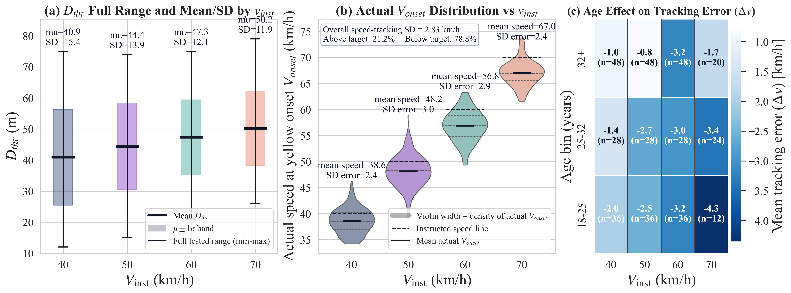

# StopGo Transformer

This repository contains the public code and processed data for predicting whether a human driver will stop or go at yellow onset, and for generating the longitudinal acceleration trajectory that follows that decision.


The model has two stages. Stage 1 predicts the stop/go decision from yellow-onset driving conditions. Stage 2 uses the predicted decision and confidence score together with the vehicle state to generate a signed acceleration trajectory using an autoregressive Transformer with kinematic constraints.

The repository does not include raw logs, personal information, exploratory analysis scripts, or alternative baseline models. The released dataset is refined for model training. Heart-rate information is included only as whole-run change values, not as a time series.

## Experiment Summary

The data were collected with a standard passenger vehicle on a road equipped with a standard traffic light. Drivers approached the light at instructed speeds of 40, 50, 60, and selected 70 km/h cases. The yellow onset distance was varied over a wide range so that the dataset includes easy-stop, easy-go, and ambiguous stop/go cases.

Vehicle motion was measured with a VBOX Touch GNSS logger using RTK correction through an NTRIP modem. Experiments were started only after RTK fix was available. The traffic light was controlled by an NVIDIA Jetson Orin connected to an STM32 relay controller. The vehicle laptop and traffic-light controller communicated through TP-Link EAP215 outdoor access points. This allowed the yellow phase to be triggered from the vehicle side at the desired longitudinal distance.

The full experiment produced 449 runs. The released decision and trajectory modeling set contains 392 decision runs after excluding non-decision trials. For each run, the dataset contains yellow-onset speed, distance threshold, TTI, required deceleration, stop/go label, demographic metadata, comfort rating when valid, maximum deceleration, and whole-run heart-rate change.



## Repository Layout

```text
.
├── assets/
│   ├── pipeline_overview.png
│   └── experiment_distribution.png
├── data/
│   ├── refined_run_level_dataset.csv
│   └── processed_trajectory_cache/
│       ├── trajectory_arrays.npz
│       ├── trajectory_meta.csv
│       └── trajectory_cache_info.json
├── train_stage1_decision.py
├── trajectory_transformer_ar.py
├── trajectory_shared_utils.py
├── requirements.txt
└── results/
```

## Environment

Python 3.11 is recommended. CUDA is used automatically by PyTorch when available.

```bash
python -m venv .venv
source .venv/Scripts/activate
pip install --upgrade pip
pip install -r requirements.txt
```

For NVIDIA GPU support, install the CUDA build of PyTorch if the installed PyTorch package is CPU-only.

```bash
pip install --upgrade torch torchvision torchaudio --index-url https://download.pytorch.org/whl/cu121
```

Check the active device with:

```bash
python - <<'PY'
import torch
print(torch.__version__)
print(torch.cuda.is_available())
print(torch.cuda.get_device_name(0) if torch.cuda.is_available() else 'CPU')
PY
```

## Data Files

The run-level dataset is stored at:

```text
data/refined_run_level_dataset.csv
```

Important columns include:

- `speed_at_yellow_kmh`
- `distance_threshold_m`
- `tti_s`
- `a_req_mps2`
- `go_decision`
- `stop_decision`
- `comfort_rating`
- `max_decel_abs_mps2`
- `hr_delta_bpm`
- `hr_delta_pct`

Stage 2 uses the processed trajectory cache:

```text
data/processed_trajectory_cache/
```

This cache contains fixed-length acceleration, speed, and distance sequences aligned from yellow onset to the stop or pass event. It allows the Transformer model to be trained and validated without publishing the raw per-sample logs.

## Stage 1 Stop/Go Decision Training

Stage 1 is a small MLP classifier. The default feature set is yellow-onset speed and required deceleration. The positive class is `go` and the negative class is `stop`.

Run a 60/40 random stratified split:

```bash
python train_stage1_decision.py \
  --features speed,a_req \
  --split-mode run_stratified \
  --train-ratio 0.60 \
  --epochs 80 \
  --seed 42 \
  --out-dir results/stage1_run_stratified
```

Run a participant-disjoint split:

```bash
python train_stage1_decision.py \
  --features speed,a_req \
  --split-mode participant_disjoint \
  --train-ratio 0.60 \
  --epochs 80 \
  --seed 42 \
  --out-dir results/stage1_participant_disjoint
```

Useful options are:

- `--features` chooses input variables. Available keys are `speed`, `dth`, `tti`, `a_req`, `age`, and `sex`.
- `--split-mode` chooses `run_stratified` or `participant_disjoint`.
- `--train-ratio` sets the training fraction.
- `--epochs` sets the number of Stage 1 training epochs.
- `--seed` fixes the random seed.
- `--force-cpu` disables CUDA.

Main outputs are `decision_metrics.json`, `validation_predictions.csv`, `decision_mlp_state_dict.pt`, `decision_scaler.npz`, and `report.txt`.

## Stage 2 Transformer Trajectory Training

Stage 2 trains the full deployed pipeline. Stage 1 is trained first. Its predicted decision label and `p_go` confidence are then fixed for the whole trajectory and passed into the autoregressive Transformer.

```bash
python trajectory_transformer_ar.py \
  --seed 42 \
  --train-ratio 0.60 \
  --decision-epochs 80 \
  --epochs 140 \
  --out-dir results/trajectory_transformer_ar
```

Useful options are:

- `--decision-epochs` controls Stage 1 training inside the full pipeline.
- `--epochs` controls Stage 2 Transformer training.
- `--train-ratio` controls the train/validation split.
- `--out-dir` controls where models, metrics, predictions, plots, and logs are written.
- `--force-cpu` runs without CUDA.

The Transformer uses a causal context window, signed acceleration feedback, terminal gating, a jerk limit of 15 m/s^3, and decision-aware acceleration bounds. The main outputs are:

- `decision_metrics.json`
- `transformer_metrics.json`
- `validation_predictions.csv`
- `validation_trajectory_arrays.npz`
- `decision_mlp_state_dict.pt`
- `trajectory_transformer_state_dict.pt`
- `feature_scalers.npz`
- `run_progress.log`
- `report.txt`

`run_progress.log` is updated during training, so it can be opened while the model runs.

## Quick Smoke Test

Use a short run to verify the installation and data paths.

```bash
python trajectory_transformer_ar.py \
  --epochs 1 \
  --decision-epochs 1 \
  --out-dir results/smoke_test \
  --force-cpu
```
